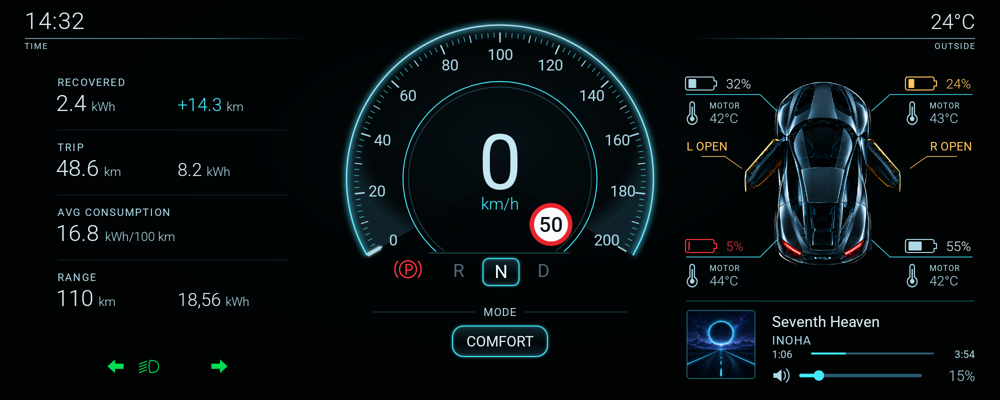
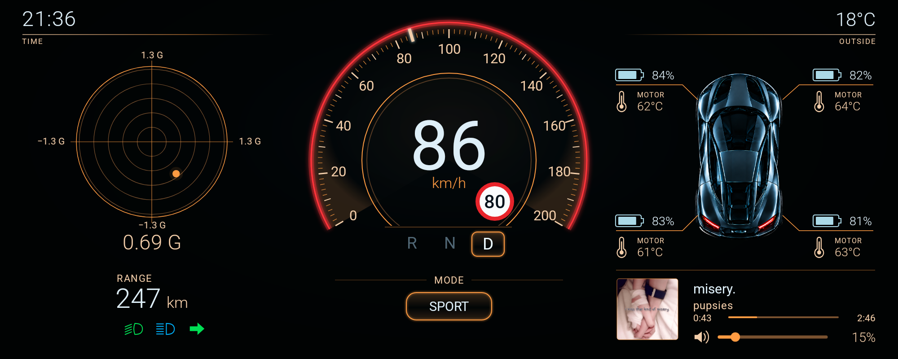

# MiDash

MiDash is an Android dashboard for MiNini. It displays vehicle telemetry and plays local music, with commands received over USB or WebSocket.

The interface uses a 2000 × 800 canvas that scales to fit landscape displays.

## Features

- COMFORT and SPORT modes with animated transitions.
- Speed, gear, parking, lights, door warnings and synchronized turn signals.
- Battery charge and motor temperature for each wheel, plus acceleration, trip, consumption and range displays.
- Android media service with background playback, cover art, track progress and volume control.

## Screenshots

### COMFORT



### SPORT



[Sample telemetry](docs/screenshots/README.md)

## Build

Requirements: JDK 17 or later and Android SDK 36. The app supports Android 8.1 (API 27) and later.

Open the project in Android Studio and sync Gradle. Set `JAVA_HOME` when building from the command line.

Audio recordings are not included. To enable playback with the default catalog, add these files to `app/src/main/assets/audio/`:

- `seventh-heaven.mp3`
- `misery.mp3`

Track metadata and cover paths are defined in [MusicCatalog.kt](app/src/main/java/com/mihior/midash/MusicCatalog.kt). The dashboard runs without audio files; unavailable tracks report a playback error.

Windows:

```powershell
.\gradlew.bat assembleDebug
```

macOS / Linux:

```sh
./gradlew assembleDebug
```

The debug APK is written to `app/build/outputs/apk/debug/app-debug.apk`.

## Release build

Configure signing in `keystore.properties` at the project root:

```properties
storeFile=PATH_TO_KEYSTORE
storePassword=STORE_PASSWORD
keyAlias=KEY_ALIAS
keyPassword=KEY_PASSWORD
```

Build a signed release without MP3 recordings:

```powershell
.\gradlew.bat assembleRelease '-Pmidash.excludeMusic=true'
```

The APK is written to `app/build/outputs/apk/release/app-release.apk`. Without signing configuration, Gradle produces an unsigned APK.

## Vehicle connection

Connect the BRIDGE to the Android device through USB host/OTG and grant USB permission. A single serial port connects automatically; multiple ports open a selection menu.

The dashboard retains the last received values. Fields without a received value display `—`. Connection and protocol errors appear in yellow.

Start BRIDGE, open its USB connection, then start ECU. This order establishes a packet boundary and allows the initial telemetry snapshot to be received.

[USB connection and recovery](BRIDGE.md) · [Binary protocol](bridge/ANDROID_BINARY_PROTOCOL.md)

## Emulator relay

The Windows relay connects a host serial port to a debug build running in the Android emulator. Python 3.10 or later is required.

Find the BRIDGE port in Device Manager, then run:

```powershell
$bridgePort = Read-Host 'BRIDGE serial port'
.\bridge\start.ps1 -Port $bridgePort
```

To stop the relay and release the port:

```powershell
.\bridge\stop.ps1
```

The launcher installs its Python dependencies on first use. [Relay configuration](BRIDGE.md#emulator-relay)

## Simulator

The Python simulator provides driving controls and sample telemetry over WebSocket. It requires Python 3.10 or later; the launcher installs PySide6 and websocket-client.

Install and open the debug app, then connect using the Android device's IP address:

```powershell
.\simulator\start.ps1 --url ws://ANDROID_IP:8765/dashboard --connect
```

For an emulator or a device connected over USB, forward the endpoint through ADB:

```powershell
adb devices -l
$deviceSerial = Read-Host 'ADB device serial'
adb -s $deviceSerial forward tcp:8765 tcp:8765
.\simulator\start.ps1 --url ws://127.0.0.1:8765/dashboard --connect
```

Select D, release parking and hold the throttle control to drive. Throttle and steering can be used together. A connected BRIDGE takes priority over simulator telemetry.

[WebSocket protocol](PROTOCOL.md)

## Development

| Directory | Contents |
| --- | --- |
| `app/` | Android renderer, telemetry transports, vehicle state and media service |
| `bridge/` | Windows serial relay, protocol specifications and integration tests |
| `simulator/` | Desktop controls, vehicle simulation and WebSocket client |
| `qa/` | Asset verification and audio cue generation |

Run the Android unit tests, build and lint checks:

```powershell
.\gradlew.bat testDebugUnitTest assembleDebug lintDebug
python .\qa\verify_package.py
```

Tablet instrumentation tests cover connection status, port selection and media-service lifecycle. Device integration scripts require ADB and an installed debug build; target-device settings are defined in those scripts.
